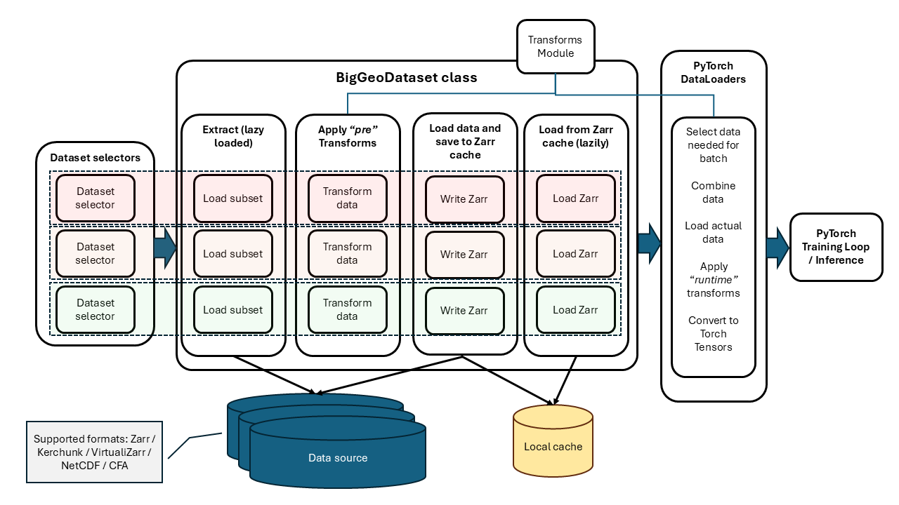

# Generic data loader for big environmental data

## Overview

Sometimes it's easiest to start with a picture:



This is a design for a PyTorch implementation of data loaders that enables the 
user to specify a recipe for loading large (TB scale) data subsets from multi-
dimensional datasets typically held in NetCDF format (and/or other gridded 
formats).

The starting point for data access will always be an aggregation file, using 
formats such as:
- Kerchunk
- Zarr
- CFA
- VirtuliZarr

NOTE: It will also work with NetCDF (without aggregation).

The approach will use the standard methods of defining PyTorch classes:
- `torch.utils.data.Dataset`
- `torch.utils.data.DataLoader`

Additionally, transforms will be composable in two parts of the process:
1. `pre_transforms`: which the user wants to run early.
2. `runtime_transforms`: which should be run just before training/inference.

### Why two transform types? 

This is because we want to optimise the data loading so that time is not 
spent idle on GPU systems when model training is happening. Our generic loader 
includes a `precache` option which instructs the loaders to run through all
the data and write it to a local cache directory in Zarr format. 

The `BigGeoDataset` class should then be able to detect whether data has been 
pre-cached and prefer to load that version if present. Otherwise it will extract
subsets and run the `pre_transforms` on-the-fly.

## Test running this approach

Set up env (on JASMIN):

```bash
source /gws/ssde/j25b/eds_ai/frame-fm/code/envs/torch-basic/bin/activate
```

Run the example:

```bash
cd generic-data-loader/
export PYTHONPATH=.
python main.py
```


